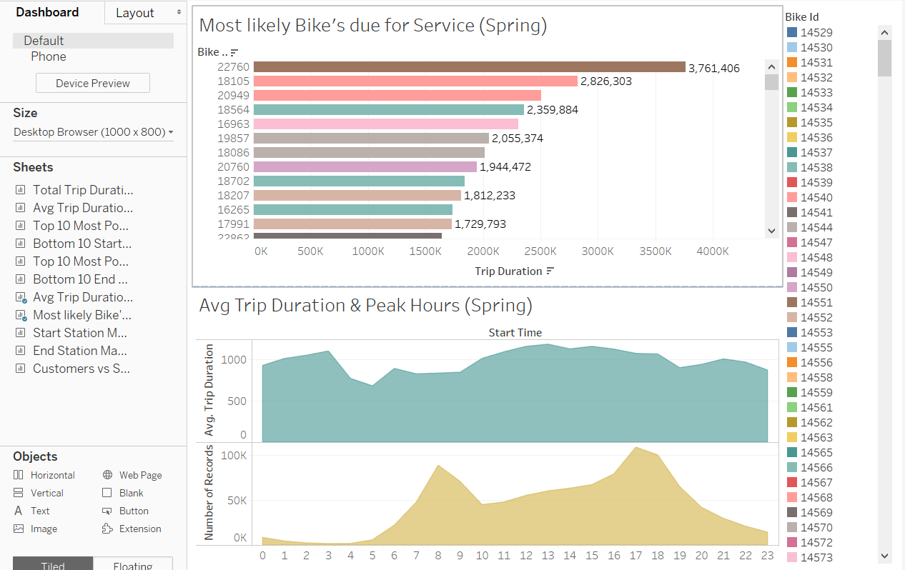

# Tableau_project

Task for this assignment is to aggregate the data found in the Citi Bike Trip History Logs and find two unexpected phenomena.
Design 2-5 visualizations for each discovered phenomena (4-10 total). 

Used visualizations to design a dashboard for each phenomena.
The dashboards werr accompanied with an analysis explaining why the phenomena may be occuring.

Basic: A static map that plots all bike stations with a visual indication of the most popular locations to start and end a journey with zip code data overlaid on top.

Advanced: A dynamic map that shows how each station's popularity changes over time (by month and year). Again, with zip code data overlaid on the map.

Created a Tableau story that brings together the visualizations, requested maps, and dashboards.

## Dashboards

       

   

   

## Story

